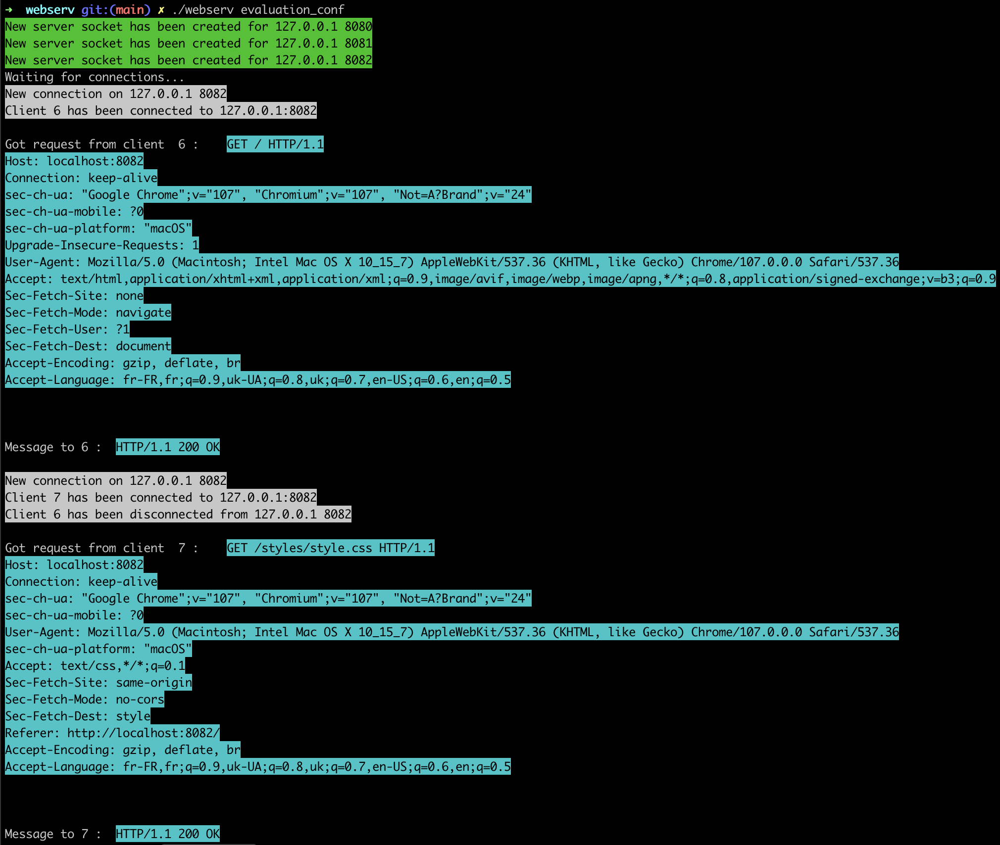
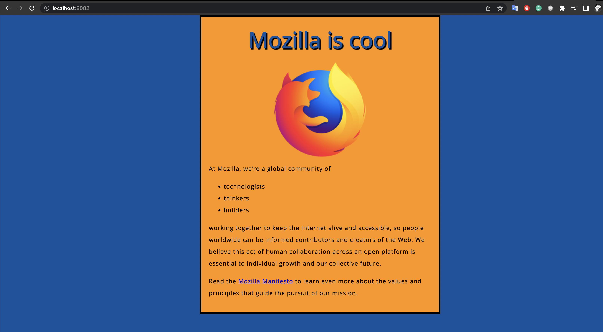

# webserv

This project is here to make you write your own HTTP server. You will be able to test it with a real browser. HTTP is one of the most used protocol on internet. Knowing its arcane will be useful, even if you won't be working on a website.  <br />  <br />
Special features:  <br />
python and php execution on server side.

## Result

Team project with: https://github.com/OlgaKush512 <br />
Success: 110/100

## Installation
Requirements: <br />
php-cgi <br />
c++ complier <br />
make <br />
python3  <br />

Makefile:

```bash
  make
```

Replace all $(PROJECT_PATH) in evaluation_conf file with result of:
```bash
  pwd
```

Let's find php-cgi executable:
```bash
  whereis php-cgi
```
Result example:
```
php-cgi: /opt/homebrew/bin/php-cgi /opt/homebrew/share/man/man1/php.1
```

Then:
```bash
  cp -f (HERE_IS_php-cgi_PATH_from_bin) ./dependencies
```
You need to do the same operation with python3.

Launch:
```bash
./webserv evaluation_conf
```

##Usage
3 websites are avalible on:
```
localhost:8080
```
```
localhost:8081
```
```
localhost:8082
```


